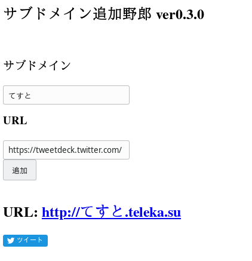

# kuso-subdomain-adder


[](https://github.com/sksat/kuso-subdomain-adder/actions/workflows/trivy-scan.yml)

A ***super-easy*** kuso subdomain utility for [telekasu](https://teleka.su) using [kuso-domains-redirector](https://github.com/KOBA789/kuso-domains-redirector) and Cloudflare API.

- main instance: [kuso-subdomain-adder.sksat.net](https://kuso-subdomain-adder.sksat.net)(on my-room server)
- sub instance: [kuso-subdomain-adder2.sksat.net](https://kuso-subdomain-adder2.sksat.net)(on cloud server)

## Deploy

```sh
$ git clone https://github.com/sksat/compose-cd     # CD service for docker-compose
$ cd compose-cd
$ sudo ./compose-cd install
$ cd ..
$ git clone https://github.com/sksat/kuso-subdomain-adder
$ cd kuso-subdomain-adder
$ cp .env.production .env
```

## FAQ

### What is kuso domain?
It's a joke domain.  
We are [kuso-domains](https://github.com/kuso-domains/).
This is a community of kuso domain, which is called クソドメイン部 in Japanese.
Our kuso domain list is in [kuso.domains](https://kuso.domains).

### Does kuso-domains have a theme song?
Yes.  
[kuso.domains](https://www.youtube.com/watch?v=o5DNvdjnKPY)  
[](https://www.youtube.com/watch?v=o5DNvdjnKPY)

### What is kuso subdomain?
kuso subdomain is a subdomain version of kuso domain like [ディープラーニングってやつで.なんとか.site](https://ディープラーニングってやつで.なんとか.site).

### Is this a web server that redirects to target link from registered subdomain?
No.
This service only adds `CNAME` and `TXT` record to [teleka.su](https://teleka.su) by Cloudflare API.  
[kuso-domains-redirector](https://redirect.kuso.domains) does the actual redirect process.

### Is this a joke project?
No.
This service is actually used when telekasu released a new song.  
Song subdomains are in the form `[song-name].teleka.su`, such as [ポピ横の狂人.teleka.su](https://ポピ横の狂人.teleka.su)

### Can I use this service?
No.
This is a service only for telekasu.

### Is [teleka.su](https://teleka.su) your domain?
Technically, yes.
But this is the domain for telekasu.

### Do you know in advance the release of a new song by telekasu?
No.
Technically, I can see the song title and its link from logs a few minutes before the release.
But I'm not doing that!

### Who are you?
[](https://vrchat.com/home/user/usr_f8229b4f-794c-4a94-bf5d-d21f3fc0daf5)

## Screenshot


